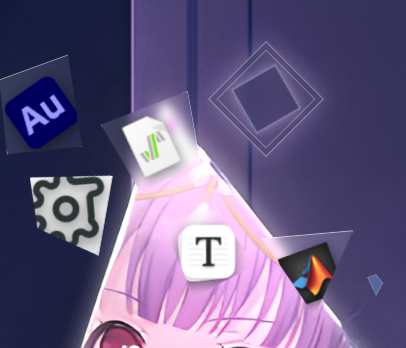
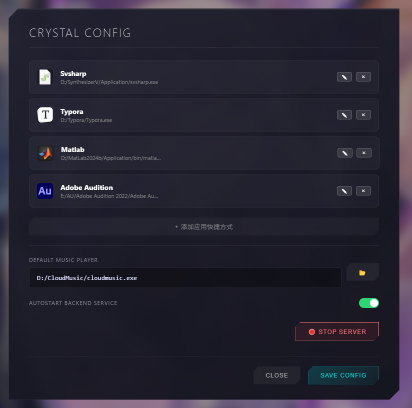
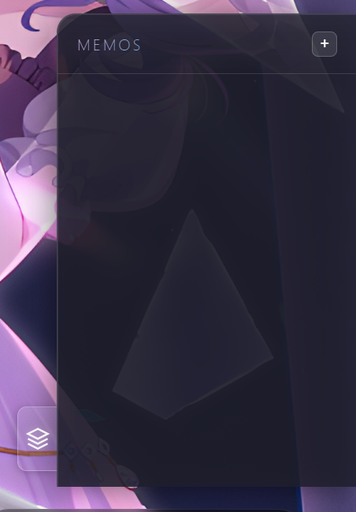
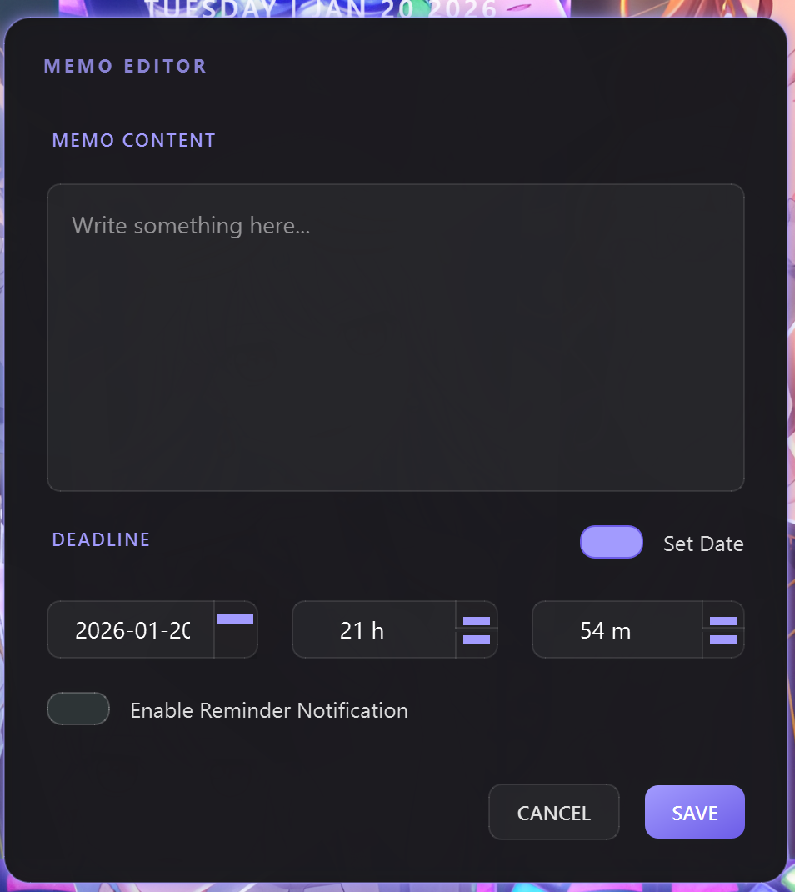

# Roselia SeiStark - 交互式 Wallpaper Engine 动态壁纸

这是一个为 Wallpaper Engine 设计的高级交互式 Web 壁纸，拥有极具质感的“玻璃拟态 (Glassmorphism)”风格，并集成了强大的 Python 后端，可实现系统控制、备忘录管理和应用程序快速启动等功能。


## ✨ 主要功能

### 前端 (Wallpaper Engine)
*   **动态特效**：优秀的交互小动画，和有明的海报风格契合。
* **使用组件**

    *   **系统监控**：实时显示 CPU 和 RAM 使用率。
    *   **应用栏**：可自定义的应用程序快捷启动栏 (Dock)。
    *   **媒体控制**：系统媒体的播放/暂停、上一曲、下一曲控制。

### 后端
*   **一体化服务**：混合 Flask (Web API) + PyQt6 (GUI) 架构。
*   **备忘录系统**：
    *   创建带有富文本内容的桌面备忘录。
    *   设置 ISO 标准的时间提醒。
    *   由壁纸直接管理的 PyQt6 玻璃质感编辑窗口。
*   **系统集成**：
    *   从壁纸 Dock 栏直接启动本地应用程序。
    *   调用原生文件选择器进行配置。
    *   支持从前端直接关闭后台服务，防止端口被一直占用。

## 🛠️ 环境要求

*   **Wallpaper Engine**：已安装 (Steam)。
*   **Python**：建议版本 3.8+。
*   **依赖库**：
    *   `PyQt6`
    *   `Flask`
    *   `Flask-Cors`
    *   `requests`
    *   `psutil`

## 🚀 安装与设置

1.  **壁纸设置**：
    *   将本项目文件夹导入 Wallpaper Engine 编辑器。
        *   或者通过 Steam 创意工坊[订阅](https://steamcommunity.com/sharedfiles/filedetails/?id=3650388153)

2.  **后端设置**：
    壁纸需要 Python 后端才能完整运行（应用启动、备忘录、系统状态等功能）。

    ```bash
    cd backend_python
    pip install -r requirements.txt
    pip install PyQt6 psutil requests
    ```

3.  **运行**：
    *   启动后端服务：
        ```bash
        python backend_python/server.py
        ```
    *   （可选）在壁纸设置中开启 "AUTOSTART BACKEND SERVICE"，让服务随系统启动。

## ⚙️ 配置指南

点击壁纸上的 **设置图标**（或触发区域）打开 **Crystal Config** 配置面板：


*   **App Shortcuts**：添加、编辑或删除 Dock 栏上的应用快捷方式。
*   **Music Player**：设置默认音乐播放器的路径。
*   **壁纸属性**：直接在 Wallpaper Engine 侧边栏调整 BGM 音量、粒子数量和可视化灵敏度。


## 📝 备忘录系统



*   点击 **Memo** 按钮打开列表。
*   **新增**：点击 "New Memo" 唤起 Python 原生玻璃质感编辑器。
*   **编辑/删除**：管理现有的备忘录。
*   **提醒**：设置截止日期，到期时系统会弹出提醒。


## 🛑 停止服务

您可以直接从 UI 界面停止后台 Python 服务：
1.  打开 **Settings**。
2.  点击红色的 **STOP SERVER** 按钮。

## 📂 项目结构

*   `index.html`: 主 Web 界面入口。
*   `style.css`: 玻璃拟态样式表和动画定义。
*   `scripts.js`: 前端逻辑、音频处理及 API 通信。
*   `backend_python/`:
    *   `server.py`: 主程序入口 (Flask API + PyQt6 应用管理器)。
    *   `memo_gui.py`: PyQt6 实现的备忘录编辑器界面。
    *   `user_config.json`: 存储用户的快捷方式配置和备忘录数据。

## 📄 开源协议

MIT License
